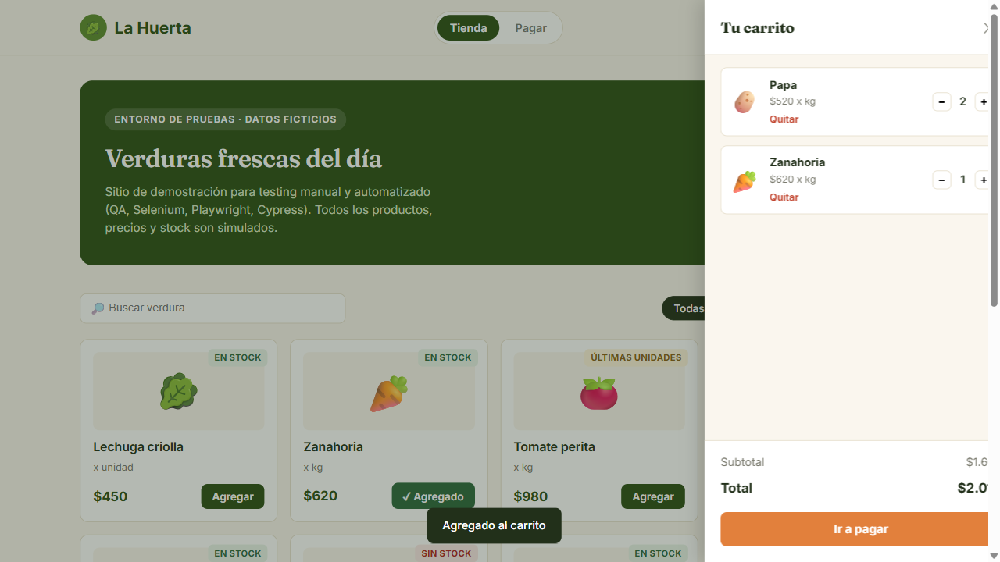
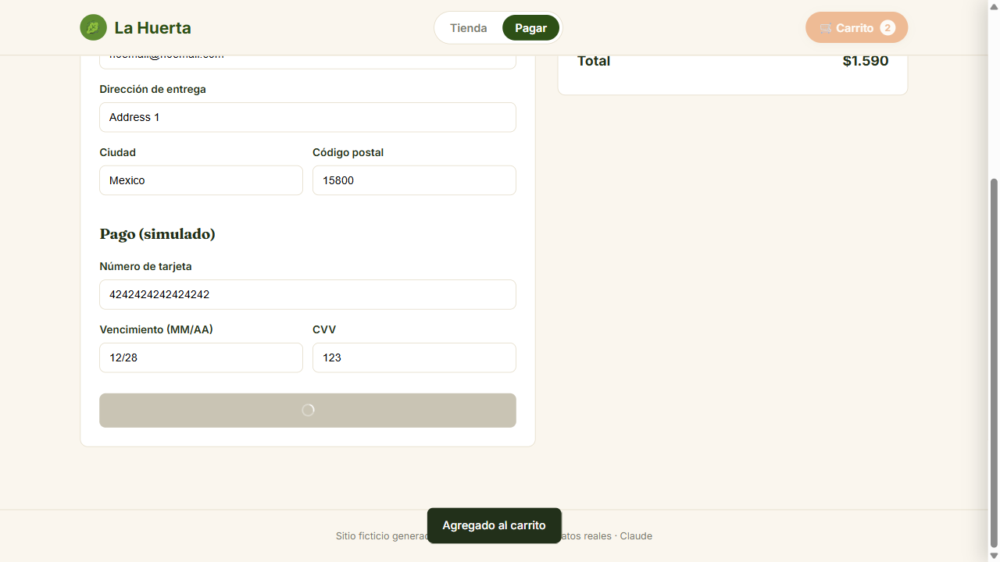
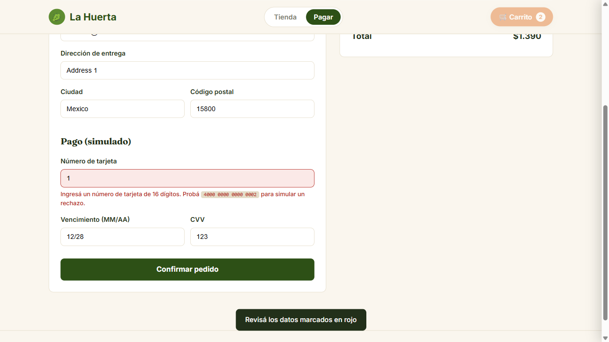
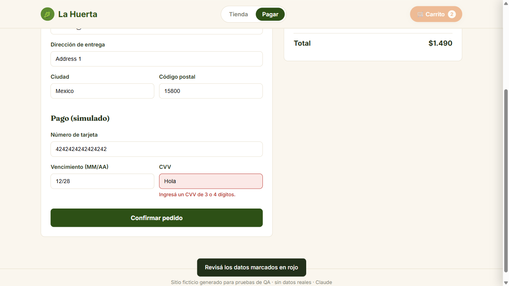

# 🎭 Playwright Java Automation Project

Web automation project built with **Java, Playwright, Maven and TestNG**, following the **Page Object Model (POM)** design pattern.

The project demonstrates End-to-End testing of an e-commerce application, including shopping cart, checkout, payment and negative testing scenarios.

---

## 🛠️ Tech Stack

- Java
- Playwright
- TestNG
- Maven
- Page Object Model (POM)
- Git / GitHub

---

## 🧪 Automated Test Scenarios

### 🛒 Shopping Cart

- Add products to the cart
- Validate cart contents
- Validate product quantity

### 💳 Checkout & Payment

- Complete checkout information
- Enter payment information
- Submit an order
- Validate order confirmation

### ❌ Negative Testing

- Invalid card information
- Invalid CVV
- Validate expected error behavior

---

## 🎭 Playwright Features

The project demonstrates:

- Playwright Locators
- Auto-waiting
- Assertions
- Form interactions
- Page navigation
- Screenshot capture
- End-to-End automation

---

## 📸 Test Evidence

### Shopping Cart



### Payment



### Invalid Card



### Invalid CVV



### Order Confirmation


---

## ▶️ Running the Tests

Clone the repository:

```bash
git clone https://github.com/brauliogonzalezhdz/playwright-java-automation.git
```

Enter the project:

```bash
cd playwright-java-automation
```

Run the tests:

```bash
mvn test
```

---

